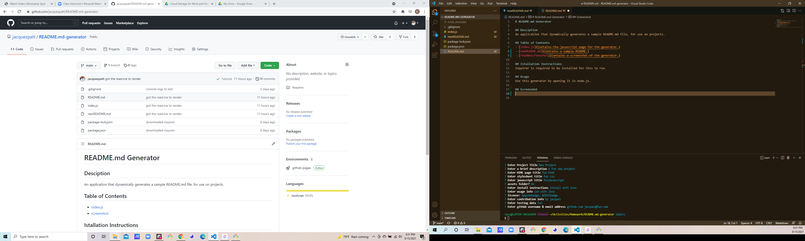

# README.md Generator

## Desciption
An application that dynamically generates a sample README.md file, for use on projects.

## Table of Contents
- [index.js](Contains-the-javascript-page-for-the-generator.)
- [newREADME.md](Contains-a-sample-README.)
- [readmescreenshot](Contains-a-screenshot-of-the-generator.)

## Istallation Instructions
Inquirer is required to be installed for this to run.

## Usage 
Use this generator by opening it in node.js.

## Screenshot

